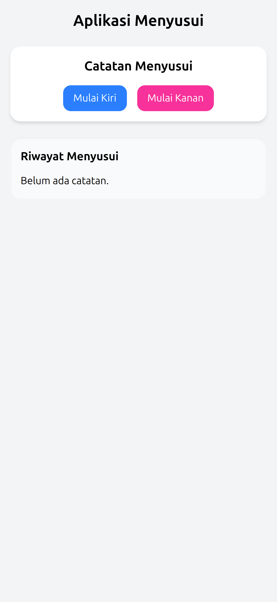

# 🍼 Nen Tracker

**Nen Tracker** is a simple, mobile-first PWA (Progressive Web App) for tracking breastfeeding sessions. It helps caregivers log which breast was used (left or right), when the session started, and how long it lasted — all offline-capable and installable to your device.



---

## ✨ Features

- ✅ Log breastfeeding sessions (left/right side, duration, start time)
- ⏱ Real-time timer (stopwatch style)
- 🕓 History of past sessions
- 📱 Installable on Android & desktop via PWA
- ⚡ Offline support with IndexedDB
- 🧘 Simple, clean UI (Tailwind CSS)

---

## 🚀 Tech Stack

- [React](https://reactjs.org/)
- [Vite](https://vitejs.dev/)
- [Tailwind CSS](https://tailwindcss.com/)
- [vite-plugin-pwa](https://vite-pwa-org.netlify.app/)
- [idb](https://www.npmjs.com/package/idb) for IndexedDB
- [uuid](https://www.npmjs.com/package/uuid) for unique log IDs

---

## 📦 Installation

```bash
git clone https://github.com/yourusername/nen-tracker.git
cd nen-tracker
npm install
npm run dev
```
